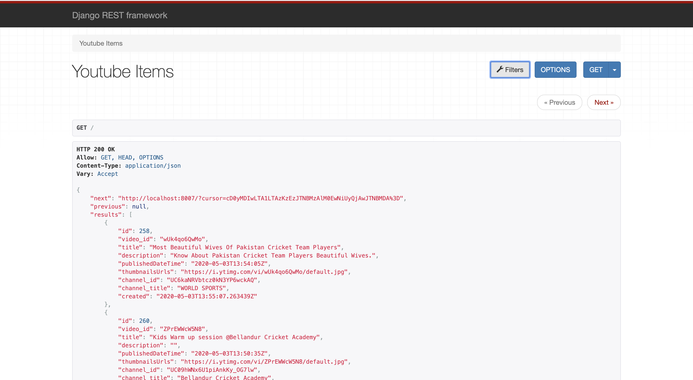

# Django Youtube Fetch Api

This project is basically an endpoint or Django api to fetch latest videos from youtube. The videos are sorted in reverse chronological order of their publishing date-time from YouTube. Also, for a given search query in the form of a paginated response.

This project uses celery to fetch latest videos after every 10 minutes and saves it to the db.

## Setup Guide
- Clone the project
- Make virtual environment using the command `python3 -m venv env`. So, by this a virtual environment named env will be     created in your system.
- Install all dependencies by using typing `pip install -r requirements.txt`.
- Inside the `setting.py` file, fill the variable `GOOGLE_API_KEYS` with the API Keys available,the list is like this => `['API_KEY_1','API_KEY_2','API_KEY_3','API_KEY_4'...]`
- You can get API key from [this](https://developers.google.com/youtube/v3/getting-started)
- Run the celery `celery -A youtube_fetch_api worker -l info` , -l info provides the log level information of celery worker.
- Run celery beat `celery -A youtube_fetch_api beat -l info`.
- Run the server using `python mange.py runserver`

## Images

Following is UI provided through django-rest-framework

### Dashboard

